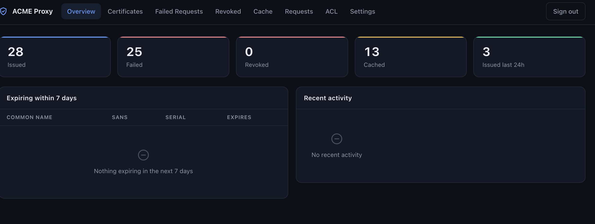

# About

`acme-proxy` allows users to get certificates from any certificate authority that supports ACME protocol (such as LetsEncrypt, Sectigo, Digicert etc.) without opening http/80 to the internet _or_ distributing api keys for your DNS server! This is a standalone ACME server built on [step-ca](https://github.com/smallstep/certificates) that operates in [registration authority (RA)](https://smallstep.com/docs/registration-authorities/) mode. It accepts certificate orders and validates certificate requests using the ACME protocol (RFC 8555), but does **NOT** sign certificates or store private keys.

## Documentation

Checkout our [documentation site](https://software.es.net/acme-proxy) for detailed examples on user guide, installation instructions, configuration etc.

## Use Cases

This architecture addresses typical enterprise constraints that prevent direct certificate issuance from LetsEncrypt:

**HTTP-01 Challenge Limitations:**

- Direct HTTP-01 usage keeps a web service on port 80 open to the internet whenever a certificate is issued or renewed, which security policies often disallow. acme-proxy reduces this to a challenge-only listener that exists solely while a request is in flight (see below), and DNS-01 or EAB modes remove the port 80 requirement entirely.

**DNS-01 Challenge Limitations:**

- Legacy DNS infrastructure lacks REST API support or ACME client integration
- Security policies restrict distribution of API tokens or TSIG keys for large DNS zones <br>

For more information on security considerations when using DNS-01 TXT challenge:

- [EFF: Technical Deep Dive on ACME DNS Challenge Validation](https://www.eff.org/deeplinks/2018/02/technical-deep-dive-securing-automation-acme-dns-challenge-validation)
- [LetsEncrypt: DNS-01 Challenge](https://letsencrypt.org/docs/challenge-types/#dns-01-challenge)

<br>**How acme-proxy mitigates security risks**

1. When solving HTTP-01 toward the upstream CA, the challenge web server on port 80 runs only for the duration of the challenge. It starts when a certificate request begins and closes automatically as soon as the last challenge completes, so port 80 is not held open permanently.
2. While it is running, the listener answers only ACME challenge token requests. There is no general-purpose web service or application code to attack, and unlike using Let's Encrypt directly there is nothing listening on port 80 the rest of the time. The listener can be scoped with `http01_bind` or fronted by DNAT/port-forwarding from the edge. If your policy forbids exposing port 80 even briefly, use DNS-01 or EAB instead.
3. No distributing DNS related api key or tsig key to ACME clients.


## How It Works

`acme-proxy` runs as an ACME server inside your trusted network, acting as an intermediary between your internal infrastructure and an upstream certificate authority which signs the certificate.

1. Your internal server (behind a firewall perimeter) requests a certificate from `acme-proxy` using standard ACME client such as certbot, acme.sh or cert-manager.io if you're using Kubernetes.
2. `acme-proxy` presents cryptographic challenges to verify domain ownership.
3. Once validation succeeds, `acme-proxy` forwards the certificate signing request to an external certificate authority for signing
4. `acme-proxy` retrieves the signed certificate bundle and returns it to your server

<br>To get signed certificates from an external CA `acme-proxy` supports three modes of operations:

### 1. HTTP-01 (no EAB required)

`acme-proxy` answers the upstream CA's HTTP-01 validation by serving `/.well-known/acme-challenge/` on port 80. Key properties:

- **No EAB needed.** Works with Let's Encrypt out of the box (a plain account email is enough), and is also supported by ZeroSSL and other public CAs.
- **Transient challenge server.** The port 80 listener is started only when a certificate request begins and closes itself as soon as the last challenge completes. Port 80 is never held open while the proxy is idle.
- **No DNS credentials of any kind.** This is the simplest mode when the proxy's public IP can accept inbound connections on port 80, either directly or via DNAT/port-forward from the edge.

Select it with `"challenge_type": "http-01"` (or leave `auto`, which falls back to HTTP-01 when no DNS provider is configured).

### 2. External Account Binding (EAB)

Some commercial certificate authorities allow their customers to validate their apex domain (example.com) once and issue an EAB key.  Using this key customers can get certs for *.example.com without having to validate every domain or subdomain (say foo.example.com) individually.


**Note:** LetsEncrypt does not support EAB. However, commercial CAs such as Sectigo, ZeroSSL, DigiCert do.

### 3. DNS01-TXT

[Lego](https://go-acme.github.io/lego/) is a well known ACME client which supports over 200 DNS providers to solve DNS01-TXT challenge. Using one of the Lego providers, acme-proxy authenticates with your DNS server and temporarily places a TXT record which the external CA can verify before issuing a signed certificate. The key benefit of using this mode is that your DNS server's API key or TSIG key lives only on acme-proxy and thus circumvents the need for distributing those credentials to all your servers.


## Quick Start

```sh
curl -fsSL https://raw.githubusercontent.com/esnet/acme-proxy/main/install.sh | sudo sh

Installing binary to /opt/acme-proxy...
Creating acme-proxy service user...
Setting ownership of installation directory...
Installing systemd service...
Reloading systemd daemon...
Enabling acme-proxy service...
Created symlink /etc/systemd/system/multi-user.target.wants/acme-proxy.service → /etc/systemd/system/acme-proxy.service.

Installation complete!

Next steps:
  1. Edit /opt/acme-proxy/ca.json and configure:
     - dnsNames: Your ACME proxy hostname
     - ca_url: Your upstream ACME CA URL
     - account_email: Your account email
     - eab_kid / eab_hmac_key: only if your CA requires EAB
       (leave both empty for Let's Encrypt)
     - challenge_type: auto | http-01 | tls-alpn-01 | dns-01
       (challenge solved toward the upstream CA)

  2. Start the service:
     sudo systemctl start acme-proxy

  3. Check status:
     sudo systemctl status acme-proxy
     sudo journalctl -u acme-proxy -f

```

The script installs acme-proxy as a systemd service with sensible defaults, all of which can be overridden with environment variables:

```sh
# Default values (all overridable)
INSTALL_DIR="${INSTALL_DIR:-/opt/acme-proxy}"
DB_DIR="${DB_DIR:-${INSTALL_DIR}/db}"
CONFIG_FILE="${CONFIG_FILE:-${INSTALL_DIR}/ca.json}"
SERVICE_USER="${SERVICE_USER:-acme-proxy}"
SERVICE_GROUP="${SERVICE_GROUP:-acme-proxy}"
```

## Configure

Review and update configuration options in [ca.json](./ca.json) before starting the acme-proxy server. `ca.json` supports `#` comments outside of string literals, so you can annotate the config in place.

```sh
vim ca.json
```

Refer to the [documentation](https://software.es.net/acme-proxy/configuration) for full set of configuration options. For a quick start the most relevant config bits are:

```json
{
  "dnsNames": ["acme-proxy.example.com"],
  ...
  "authority": {
    "type": "externalcas",
    "config": {
      "ca_url": "",
      "account_email": "",
      "eab_kid": "",
      "eab_hmac_key": "",
      "dns01_txt":{
        "providers": "",
        "dns_servers":"",
        "env_vars": {}
      }
    }
  },
  ...
    "commonName": "acme-proxy.example.com"
}
```

Most commercial certificate authorities (such as Sectigo) support certificate issuance over external account binding. You will need to get EAB credentials i.e HMAC Key and Key ID associated with your account. To get signed certs from CertiNext/InCommon use `https://acme-us.certinext.io/v1/directory` as shown below

```json
  "ca_url": "https://acme-us.certinext.io/v1/directory"
  "account_email": "certadmin@example.com",
  "eab_kid": "",
  "eab_hmac_key": "",
```

To get certificates signed from LetsEncrypt use the following config options

```json
  "ca_url": "https://acme-v02.api.letsencrypt.org/directory"
  "account_email": "certadmin@example.com",
  "dns01_txt": {
    "provider": "lego-dns-provider-code",
    "dns_servers": ["8.8.8,8", "1.1.1.1", "2606:4700:4700::1111"],
    "env_vars": {
      "LEGO_PROVIDER_API_KEY": "xxxxxxx",
    }
  }
```

| Field                   | Description                                                                  |
|-------------------------|------------------------------------------------------------------------------|
| `dns01_txt.provider`    | [Lego Provider](https://go-acme.github.io/lego/dns/index.html) CLI Flag name |
| `dns01_txt.dns_servers` | Use your authoritative DNS server's addresses to avoid caching/TTL problems  |
| `dns01_txt.env_vars`    | Environment variables specific to your Lego DNS Provider for authentication  |

## Admin Dashboard, ACL & Runtime Settings



This fork adds an operational layer on top of the proxy, all configured via top-level `ca.json` blocks:

- **Web dashboard** (`dashboard` block): login-protected console on its own port (default `8443` when enabled). It shows overview stats, domain-grouped certificate history with per-domain request details (client IP, timestamps, status, failure reasons), failed-request analysis, revocation history, certificate cache management with per-domain cache deletion, a live ACME request log, an ACL editor, and a settings editor. HTTPS is automatic: the dashboard serves the same certificate as the client-facing `:443` listener (shared key and identity, resolved through the cert cache), so it never causes an extra upstream issuance. The certificate is renewed in the background and swapped without a restart. Credentials are required: the dashboard refuses to start unless `username` and `password` are set explicitly.
- **Client ACL** (`acl` block): a plain-text allow-list (`acl.file`) of IPs and CIDR subnets (one per line, `#` comments) that gates every ACME request. It is hot-reloaded on file change, editable from the dashboard, and fails closed if the configured file becomes unreadable. It honors `X-Forwarded-For` behind a reverse proxy.
- **Runtime settings**: the dashboard Settings tab edits a safe subset of `ca.json` and applies the changes without restarting the daemon. This covers the upstream CA identity (with automatic ACME account re-registration), challenge type and DNS provider, timeouts, cache bounds (`cert_cache_max_age`, `cert_cache_min_validity`), concurrency limit, dashboard credentials, port and TLS files, and the ACL path. Saves are validated end to end before anything is written, and every save keeps a backup at `ca.json.bak-settings`.
- **Bounded certificate cache**: cached certificates stop being served after `cert_cache_max_age` days (default `30`), which keeps the renewal cadence predictable and safely inside upstream rate limits such as Let's Encrypt's 5 certificates per week per name. The HTTP-01 challenge listener also closes itself when idle, so port 80 is exposed only while a challenge is in flight.

See the [configuration reference](docs/content/configuration.md) for the full field list.

### Starting acme-proxy

After configuring `ca.json` file simply start the systemd service

```sh
sudo systemctl start acme-proxy
```

Upon starting acme-proxy it automatically obtains a SSL certificate for itself as part of bootstrapping. This certificate and it's private key are stored in memory and are automatically rotated using the EAB credentials provided in `ca.json`

```sh
$ sudo systemctl status acme-proxy

badger 2025/07/15 22:12:24 INFO: All 1 tables opened in 0s
badger 2025/07/15 22:12:24 INFO: Replaying file id: 0 at offset: 105133
badger 2025/07/15 22:12:24 INFO: Replay took: 5.99µs
2025/07/15 22:12:25 Building new tls configuration using step-ca x509 Signer Interface
2025/07/15 22:12:25 Initializing ACME client...
2025/07/15 22:12:25 [INFO] acme: Registering account for admin@example.com
2025/07/15 22:12:26 ACME client initialized successfully
2025/07/15 22:12:26 Processing certificate request for domains: [proxy.example.com]
2025/07/15 22:12:26 Starting certificate request processing for domains: [proxy.example.com]
2025/07/15 22:12:26 [INFO] [proxy.example.com] acme: Obtaining bundled SAN certificate given a CSR
2025/07/15 22:12:27 [INFO] [proxy.example.com] AuthURL: https://acme.sectigo.com/v2/InCommonRSAOV/authz/sx4qvINAdWw2IjplmyH6kg
2025/07/15 22:12:27 [INFO] [proxy.example.com] acme: authorization already valid; skipping challenge
2025/07/15 22:12:27 [INFO] [proxy.example.com] acme: Validations succeeded; requesting certificates
2025/07/15 22:12:27 [INFO] Wait for certificate [timeout: 30s, interval: 500ms]
2025/07/15 22:12:33 [INFO] [proxy.example.com] Server responded with a certificate.
2025/07/15 22:12:33 Successfully obtained certificate from InCommon for domains: [proxy.example.com]
2025/07/15 22:12:33 Starting Smallstep CA/0000000-dev (linux/amd64)
2025/07/15 22:12:33 Documentation: https://u.step.sm/docs/ca
2025/07/15 22:12:33 Community Discord: https://u.step.sm/discord
2025/07/15 22:12:33 Config file: ca.json
2025/07/15 22:12:33 The primary server URL is https://acmeproxy.example.com:443
2025/07/15 22:12:33 Root certificates are available at https://acmeproxy.example.com:443/roots.pem
2025/07/15 22:12:33 X.509 Root Fingerprint: a6cf64dbb4c8d5fd19ce48896068db03b533a8d1336c6256a87d00cbb3def3ea
2025/07/15 22:12:33 Serving HTTPS on proxy.example.com:443 ...
```

### Obtaining a certificate

While the example below uses `acme.sh` as the ACME client in standalone mode, we've also tested using `certbot` and `cert-manager` on Kubernetes with equal success. For more examples see [user guide](https://software.es.net/acme-proxy/user/).

```sh
$ ./acme.sh --issue \
    --server https://acmeproxy.example.com/acme/acme/directory \
    --domain myserver.example.com \
    --standalone \
    --listen-v6

[Tue 15 Jul 22:41:01 CDT 2025] Using CA: https://acmeproxy.example.com/acme/acme/directory
[Tue 15 Jul 22:41:01 CDT 2025] Standalone mode.
[Tue 15 Jul 22:41:01 CDT 2025] Creating domain key
[Tue 15 Jul 22:41:01 CDT 2025] The domain key is here: /root/.acme.sh/myserver.example.com_ecc/myserver.example.com.key
[Tue 15 Jul 22:41:01 CDT 2025] Single domain='myserver.example.com'
[Tue 15 Jul 22:41:02 CDT 2025] Getting webroot for domain='myserver.example.com'
[Tue 15 Jul 22:41:02 CDT 2025] Verifying: myserver.example.com
[Tue 15 Jul 22:41:02 CDT 2025] Standalone mode server
[Tue 15 Jul 22:41:04 CDT 2025] Success
[Tue 15 Jul 22:41:04 CDT 2025] Verification finished, beginning signing.
[Tue 15 Jul 22:41:04 CDT 2025] Let's finalize the order.
[Tue 15 Jul 22:41:04 CDT 2025] Le_OrderFinalize='https://acmeproxy.example.com/acme/acme/order/ugickkyMzE0hoHZhBLGuGqG3ab1N0hwz/finalize'
[Tue 15 Jul 22:41:12 CDT 2025] Downloading cert.
[Tue 15 Jul 22:41:12 CDT 2025] Le_LinkCert='https://acmeproxy.example.com/acme/acme/certificate/b3A7d7rZA78ijaKwcR0n5xtxf8PAeE1v'
[Tue 15 Jul 22:41:13 CDT 2025] Cert success.
-----BEGIN CERTIFICATE-----
MIIE1jCCBHygAwIBAgIQExzgaVAT9gRo8qefSNVMhzAKBggqhkjOPhxvquwvdyu5
CQYDVQQGEwJVUzESMBAGA1UEChMJSW50ZXJuZXQyMSEwHwYDVQQDExhJbkNvbW1v
biBFQ0MgU2VydmVyIENBIDIwHhcNMjUwNzE2MDAwMDAwWhcNMjYwNzE2MjM1OTU5
WjBpMQswCQYDVQQGEwJVUzETMBEGA1UECBMKQ2FsaWZvcm5pYTEgMB4GA1UEChMX
RW5lcmd5IFNjaWVuY2VzIE5ldHdvcmsxIzAhBgNVBAMTGnNlYmFzdGlhbjEuYWNt
ZS1kZXYuZXMubmV0MFkwEwYHKoZIzj0CAQYIKoZIzj0DAQcDQgAEl+z2kyLu0aHy
79D457pdQSzWNmqsxg83oz3QHgMoP3lwCGk6G461dvbwrAbC+GMAmmlJiWq6Kg6r
3tHKkrJQ5aOCAykwggMlMB8GA1UdIwQYMBaAFDJfCtkYWe1BcSHV7gni2a+y1w+x
MB0GA1UdDgQWBBRnH5X2pNXqYObRzzZgcRhlBH/YijAOBgNVHQ8BAf8EBAMCB4Aw
DAYDVR0TAQH/BAIwADAdBgNVHSUEFjAUBggrBgEFBQcDAQYIKwYBBQUHAwIwSQYD
VR0gBEIwQDA0BgsrBgEEAbIxAQICZzAlMCMGCCsGAQUFBwIBFhdodHRwczovL3Nl
Y3RpZ28uY29tL0NQUzAIBgZngQwBA2692AYDVR0fBDkwNzA1oDOgMYYvaHR0cDov
L2NybC5zZWN0aWdvLmNvbS9JbkNvbW1vbkVDQ1NlcnZlckNBMi5jcmwwcAYIKwYB
BQUHAQEEZDBiMDsGCCsGAQUFBzAChi9odHRwOi8vY3J0LnNlY3RpZ28uY29tL0lu
Q29tbW9uRUNDU2VydmVyQ0EyLmNydDAjBggrBgEFBQcwAYYXaHR0cDovL29jc3Au
c2VjdGlnby5jb20wJQYDVR0RBB4wHIIac2ViYXN0aWFuMS5hY21lLWRldi5lcy5u
ZXQwggF+BgorBgEEAdZ5AgQCBIIBbgSCAWoBaAB2ANgJVTuUT3r/yBYZb5RPhauw
+Pxeh1UmDxXRLnK7RUsUAAABmBFSahIAAAQDAEcwRQIhALH3c5u5Y6Vns6FhsnNK
JsrL8Fu5qD58fJBHHohL7jKOAiBsXD8Qg+f+RH3Hl7I0G6H0wKWMrGCmM9jyYCsM
XfXXvAB2AKyrMHBs6+yEMfQT0vSRXxEeQiRDsfKmjE88KzunHgLDAAABmBFSac8A
AAQDAEcwRQIhAN3Sd4gWxB0y4aD/0hF4QkbAop6D3tl9t70nFhjvHhLGAiBCT8TQ
Qop++H/BhJcYMVP59BN5ATOBdp4iRNUr/gJL+gB2ANdtfRDRp/V3wsfpX9cAv/mC
yTNaZeHQswFzF8DIxWl3AAABmBFSacsAAAQDAEcwRQIgImeOxwmllsMJHtcH9in5
vTSM+XGMDG/pvHg1Bfyti/QCIQDDzebqT+5OhK0cgNHP0Yyo9IbbFT3hUF5j5ssY
Pn+jCzAKBggqhkjOPQQDAgNIADBFAiEA7UApgH/4lqVIidf6hQt0KS+Wx60I2HoE
oSlzzVurgu0CIFeUruafCMHm2SzuP1eUCgAcMBHtTiugiduq+726bxcw2ln0noLE
-----END CERTIFICATE-----
[Tue 15 Jul 22:41:13 CDT 2025] Your cert is in: /root/.acme.sh/myserver.example.com_ecc/myserver.example.com.cer
[Tue 15 Jul 22:41:13 CDT 2025] Your cert key is in: /root/.acme.sh/myserver.example.com_ecc/myserver.example.com.key
[Tue 15 Jul 22:41:13 CDT 2025] The intermediate CA cert is in: /root/.acme.sh/myserver.example.com_ecc/ca.cer
[Tue 15 Jul 22:41:13 CDT 2025] And the full-chain cert is in: /root/.acme.sh/myserver.example.com_ecc/fullchain.cer
```

### Verify

Let's decode the certificate just to be sure ;-)

```sh
$ openssl x509 -in myserver.example.com.cer -noout -text
Certificate:
    Data:
        Version: 3 (0x2)
        Serial Number:
            13:1c:e0:69:50:13:f6:04:68:f2:a7:9f:48:d5:4c:87
        Signature Algorithm: ecdsa-with-SHA256
        Issuer: C = US, O = Internet2, CN = InCommon ECC Server CA 2
        Validity
            Not Before: Jul 16 00:00:00 2025 GMT
            Not After : Jul 16 23:59:59 2026 GMT
        Subject: C = US, ST = California, O = Energy Sciences Network, CN = myserver.example.com
        Subject Public Key Info:

```

We have our certificate signed by our certificate authority i.e InCommon 🎉

## Benefits

Using ACME with commercial CAs in enterprise environments provides several advantages:

**Trusted Certificates:**

- Certificates are signed by publicly trusted CAs are already in system trust stores
- Eliminates the operational burden of distributing and maintaining custom root certificates across endpoints, servers, and client devices

**Automation and Self-Service:**

- Leverage standard ACME clients (Certbot, acme.sh, cert-manager.io) for certificate issuance, automatic renewals.
- Enable self-service certificate requests for development and infrastructure teams
